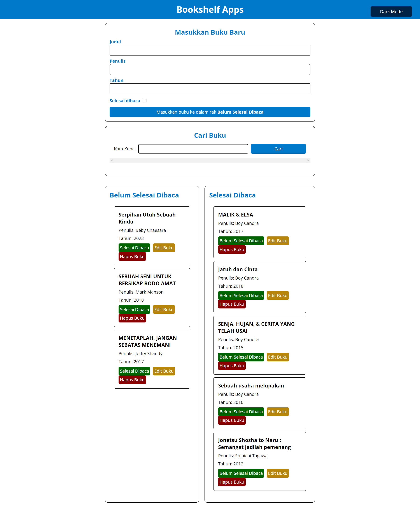
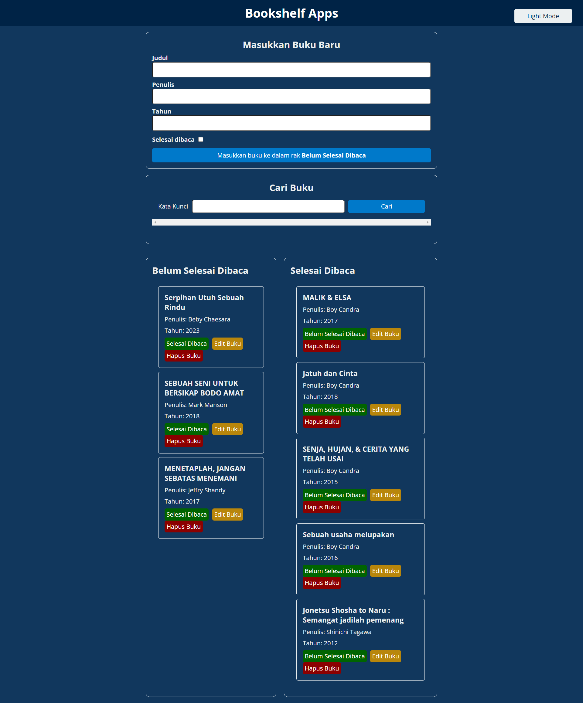

# Bookshelf-Apps
This website is a data management application using DOM and web storage that uses HTML, CSS and Javascript. This project is the final project, aka the final result of the Dicoding submission.

## Feature Description
- `Tambah Buku` atau `Add Book`: Users can add new books with title, author, year of publication, and status whether they have been read or not. Once added, the book will appear on the bookshelf according to its status.
- `Edit Buku` atau `Edit Book`: Users can edit existing book information, including title, author, year of publication, and finished reading status.
- `Hapus Buku` atau `Delete Book`: User can delete book from bookshelf.
- `Pencarian Buku` atau `Book Search`: There is a book search feature based on title, author or year of publication. Users can search for books based on certain keywords.
- `Rak Buku "Belum Selesai Dibaca"` atau `Unfinished Reading Bookshelf`: Displays a list of unfinished books. Users can move books to the shelf after reading. Apart from that, users can also edit and delete books from this shelf.
- `Rak Buku "Selesai Dibaca"` atau `Bookshelf "Completed Reading"`: Displays a list of books that have been completed reading. Users can move books to the shelf before they have finished reading them. Apart from that, users can also edit and delete books from this shelf.
- `Indikator Status Buku` atau `Book Status Indicator`: Each book is marked with read or unfinished status. This helps users to distinguish between books they have read and those they have not.
- `Dark Mode and Light Mode`: With dark and light modes, users can switch between two different layouts according to their visual preferences. Dark mode is usually easier on the eyes when using apps in low lighting conditions.

## Screen Capture Website
The following is a screen capture from the Bookshelf Apps Website:
- `Light Mode`
 

- `Dark Mode`

## Author
[@Ika Nurfitriani](https://github.com/ikanurfitriani)